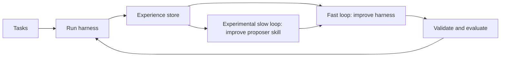

# Meta-Agent

**Continual learning for agents, without weight updates.**

Meta-Agent turns execution traces into persistent improvements to the system
around a language model. It learns at two timescales:

- a **fast loop** improves the task-facing harness, including prompts, tools,
  hooks, stopping criteria, subagents, and control flow;
- an experimental **slow loop** improves the proposer skill that diagnoses
  failures and generates future harness changes.

The base model remains frozen. Meta-Agent keeps what it learns in harness code
and versioned proposer instructions, backed by an on-disk experience store.

> **Research question:** Can an agent improve both its harness and the process
> used to improve that harness?

[Read the technical report →](https://www.canvas.inc/research/meta-agent)

<p align="center">
  <a href="#method">Method</a> ·
  <a href="#preliminary-result">Result</a> ·
  <a href="#quickstart">Quickstart</a>
</p>

<p align="center">
  
  
  
</p>

## Overview

An agent is more than its model. The harness decides what context the model
sees, which tools it can call, how it tracks state, when it checks its output,
and when it stops.

Meta-Agent treats that harness as an editable program. It runs the current
harness, records task-level traces and outcomes, proposes a targeted change,
and evaluates the resulting candidate. It keeps both wins and failures so the
next proposer can see what worked and what already failed.

After several iterations, an optional second agent compares proposer traces
with candidate outcomes, then updates the instructions that guide future
proposals. One loop improves the task harness; the other improves the process
that writes the next harness.

Our technical report evaluates the fast loop. The repository also implements
the slow loop, but we haven't measured whether it improves transfer or
retention yet.

## Method



### Fast loop: improve the harness

Each optimization iteration:

1. Runs the current harness on a search split.
2. Stores per-task results, traces, costs, and runtime metadata.
3. Diagnoses failures and states a concrete hypothesis.
4. Produces one or more candidate harnesses.
5. Validates, smoke-tests, and evaluates each candidate.
6. Selects the next candidate using the configured evaluation policy.

The optimizer can modify the complete decision procedure around the model:

- prompt and message construction;
- tools and subroutines;
- routing and state management;
- verification, retry, and fallback logic;
- turn budgets and stopping conditions;
- subagent-style orchestration; and
- cost, latency, and token controls.

### Experimental slow loop: improve the optimizer

With skill evolution enabled, Meta-Agent periodically reviews several
optimization iterations together. It looks for repeated failure patterns,
missed evidence, bundled changes, successful strategies, and search
stagnation. It then makes a small, versioned update to the proposer
instructions.

The goal is to stop the proposer from repeating the same mistakes in later
runs.

### Persistent experience

Every candidate preserves the evidence needed to audit the search:

```text
experience/<run>/candidates/<candidate>/
├── harness.py
├── proposal_notes.json
├── scores.json
├── summary.md
└── per_task/
    ├── <task>.json
    ├── <task>_trace.jsonl
    ├── <task>_events.jsonl
    └── <task>_agent_result.json
```

You can trace every candidate back to the tasks inspected, the hypothesis
proposed, the code changed, and the behaviors that improved or regressed.

## Preliminary result

On the airline domain of tau-bench v3, Meta-Agent improved a frozen Claude
Haiku 4.5 agent while keeping the model, benchmark, and official evaluator
fixed. The proposer used Claude Opus 4.6, with 35 tasks for search and 15 for
candidate selection.

| Method | Search signal | Selection accuracy |
| --- | --- | ---: |
| Vanilla harness | None | 10/15 (66.7%) |
| Label-guided Meta-Agent | Gold labels | 12/15 (80.0%) |
| Judge-guided Meta-Agent | LLM critiques | **13/15 (86.7%)** |

The judge-guided run reached its best result at epoch 5. Changes included a
rewritten system prompt, a stop condition, and a skill containing domain
rules. See the [technical report](https://www.canvas.inc/research/meta-agent)
for the per-epoch harness evolution and analysis.

These are single-run results on a small split. We used the 15-task split during
candidate selection, so we report it as selection data rather than an untouched
final test set. The result evaluates the fast loop, not the experimental
proposer-skill loop.

## Harness interface

A program harness is one Python file with one asynchronous entrypoint:

```python
async def run(ctx):
    result = await ctx.call_model(
        system="You are a careful task solver.",
        messages=[{"role": "user", "content": str(ctx.task)}],
        max_tokens=1024,
    )
    return ctx.finish(result.text.strip())
```

The benchmark adapter owns task selection, labels, and scoring. The harness
owns the decision procedure. This boundary lets Meta-Agent change agent
behavior without modifying the benchmark or the underlying model.

The same interface supports evaluator harnesses, where the editable program
can control trajectory rendering, evidence extraction, rubric routing,
judgment, parsing, and verdict verification.

## Quickstart

### Install

```bash
git clone https://github.com/canvas-org/meta-agent.git
cd meta-agent
python -m pip install -e .
meta-agent --help
```

Meta-Agent requires Python 3.11 or later. Codex-based runs need
`OPENAI_API_KEY`; Claude-based runs need AWS Bedrock credentials. See
[`.env.example`](./.env.example).

### Run an optimization loop

```bash
meta-agent loop \
  --benchmark benchmarks/plan_rewardbench/benchmark.yaml:search \
  --holdout benchmarks/plan_rewardbench/benchmark.yaml:val \
  --accept-on-holdout \
  --final-test benchmarks/plan_rewardbench/benchmark.yaml:test \
  --baseline harnesses/reward_models/plan_rewardbench/pairwise_judge \
  --run-name plan-rb-demo \
  --iterations 5
```

The `--holdout` flag supplies the split used during selection. If the loop
consults it repeatedly, treat it as validation data. `--final-test` supplies a
split the proposer never sees during search.

### Enable proposer-skill evolution

Add the following flags to an optimization run:

```bash
--evolve-skill --skill-evolve-every 5
```

Skill evolution updates the active proposer instructions and archives each
version under `experience/skills/`. Run these experiments in a clean checkout
so the instruction changes remain easy to inspect.

### Inspect results

```bash
meta-agent list --benchmark plan-rb-demo
meta-agent pareto --benchmark plan-rb-demo
meta-agent show evo_001 --benchmark plan-rb-demo
meta-agent failures evo_001 --benchmark plan-rb-demo
meta-agent diff baseline evo_001 --benchmark plan-rb-demo
```

See [the Modal guide](./meta_agent/cloud/MODAL.md) for longer searches.

## Repository layout

```text
meta_agent/
  core/                    benchmarks and persistent experience
  loop/                    propose, validate, evaluate, and accept loop
  task_runner/             runtime dispatch and execution
  harness_contracts/       supported harness interfaces
  proposer_instructions/   fast- and slow-loop proposer contracts
  cloud/                   Modal deployment

benchmarks/
  tau3/                    tau-bench v3 task agents
  plan_rewardbench/        Plan-RewardBench evaluators
  tau3_trajectory_judge/   trajectory-level evaluators

harnesses/
  starter/                 minimal harness template
  agents/                  task-agent harnesses
  reward_models/           evaluator harnesses
```

## Research directions

We still need to answer a basic question: after the proposer learns on one
benchmark, does it improve faster on the next one, or does it carry over brittle
rules? A sequential experiment will measure transfer, forgetting,
proposals-to-target, and performance on earlier tasks after each stage.

We plan to compare the full system with a reset optimizer, a run that keeps
experience but freezes the skill, and a run that evolves the skill without
sharing prior task traces.

## Limitations

- Meta-Agent never changes the base model weights. It learns through harness
  code, proposer instructions, and stored experience.
- The current result covers one benchmark. It doesn't show transfer or
  resistance to forgetting.
- Repeated selection can overfit validation tasks. Keep final-test data hidden
  until search is complete.
- Skill evolution can learn brittle or benchmark-specific heuristics.
- Results depend on benchmark coverage and evaluator quality.
- Harness search consumes model calls and evaluation compute; cost should be
  reported alongside performance.

## Related work

Related systems include [DSPy](https://arxiv.org/abs/2310.03714),
[Automated Design of Agentic Systems](https://arxiv.org/abs/2408.08435), and
the [Darwin Gödel Machine](https://arxiv.org/abs/2505.22954). Meta-Agent keeps
the model frozen and learns in the surrounding harness, with separate loops
for changing the task system and the proposer that writes it.

For detailed experiments, see
[Meta-Agent: Continual Learning for Agents](https://www.canvas.inc/research/meta-agent).
Our related report
[Meta-Reward: Reward Modeling as Harness Optimization](https://www.canvas.inc/research/reward-models)
applies the fast-loop method to evaluator harnesses around frozen LLM judges.

## Citation

```bibtex
@software{sleiman_meta_agent_2026,
  author = {Essam Sleiman},
  title = {Meta-Agent: Continual Learning for Agents},
  year = {2026},
  publisher = {Canvas},
  url = {https://github.com/canvas-org/meta-agent}
}
```

Meta-Agent is an open research project by **Essam Sleiman** at **Canvas**.

## License

Released under the MIT License. See [`LICENSE`](./LICENSE).
